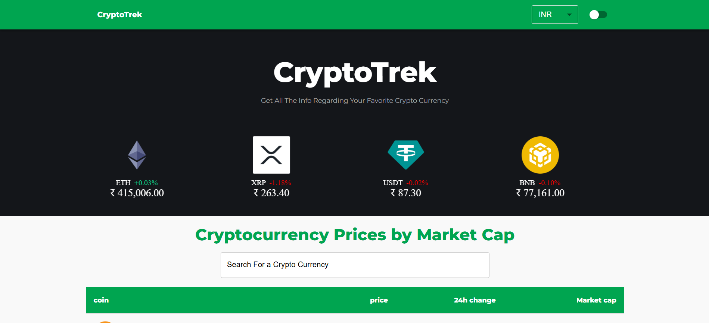
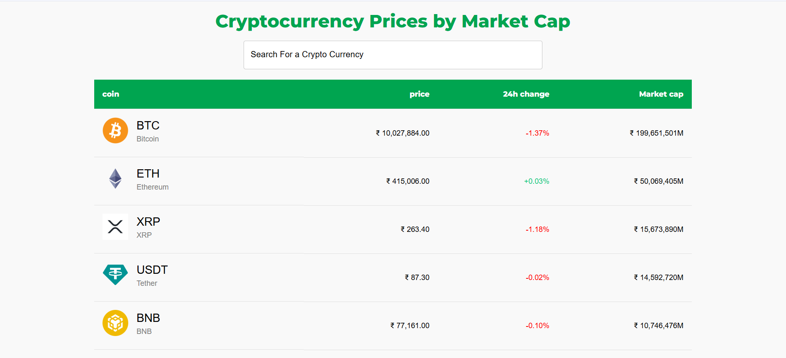
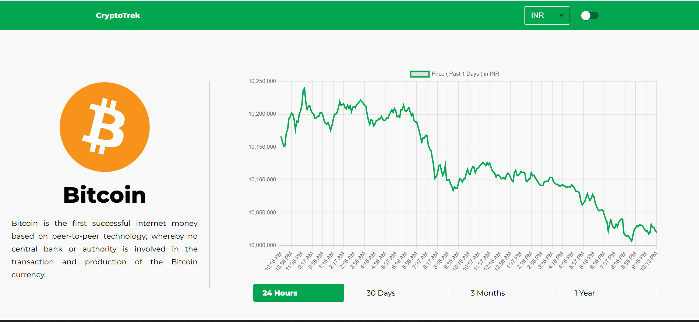
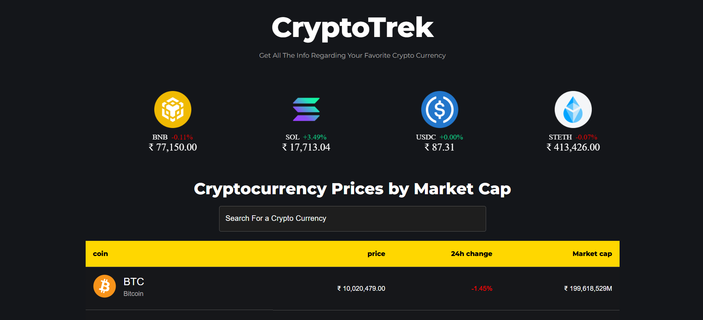
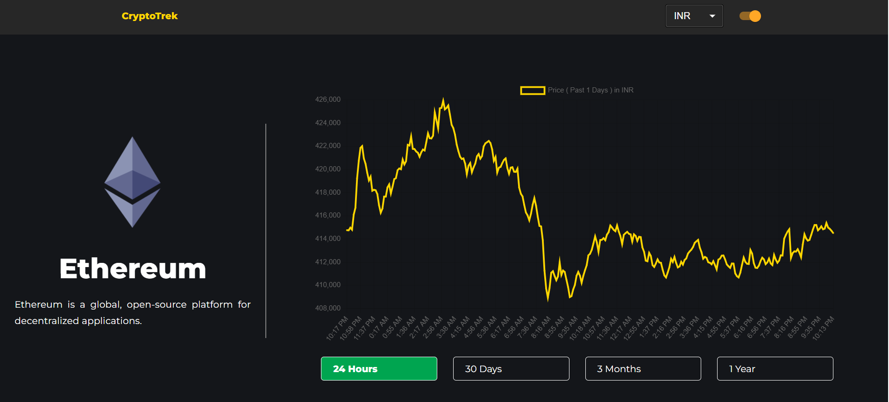

# 🚀 CryptoTrek - Cryptocurrency Tracker

A modern, responsive cryptocurrency tracking application built with React that provides real-time cryptocurrency data, interactive charts, and a beautiful user interface.

## 🚀 Live Demo

- ### **⚠️ Note:** If the page looks blank, please click on **"CryptoTrek"** ***title*** on top-left side to load the site.

- **Live Demo** - https://kunalsahu2002.github.io/Crypto-Tracker/

## 📱 Screenshots












---


## ✨ Features

### 🎯 Core Features
- **Real-time Cryptocurrency Data**: Live price updates from `CoinGecko API`
- **Interactive Charts**: Historical price charts with customizable time periods (1D, 1W, 1M, 3M, 1Y)
- **Currency Support**: Switch between USD and INR with real-time conversion
- **Dark/Light Theme**: Toggle between dark and light themes for better user experience
- **Responsive Design**: Fully responsive design that works on desktop, tablet, and mobile

### 📊 Data Display
- **Trending Coins Carousel**: Auto-scrolling `carousel` showing top trending cryptocurrencies
- **Comprehensive Coin Table**: Detailed table with market cap, price changes, and 24h performance
- **Search Functionality**: Search cryptocurrencies by name or symbol
- **Pagination**: Navigate through large datasets with pagination
- **Detailed Coin Pages**: Individual pages for each cryptocurrency with comprehensive information

### 🎨 User Interface
- **Modern UI/UX**: Clean, professional design using `Material-UI` components
- **Interactive Elements**: Hover effects, smooth transitions, and intuitive navigation
- **Loading States**: Proper loading indicators and progress bars
- **Error Handling**: Graceful error handling and user feedback

## 🛠️ Technologies Used

### Frontend
- **React** 
- **Vite** 
- **Material-UI 7.0.1** - React UI framework for consistent design
- **React Router DOM** - Client-side routing
- **Chart.js** - Interactive charts and graphs
- **React Chart.js 2 5.3.0** - React wrapper for Chart.js
- **React Alice Carousel 2.9.1** - Touch-friendly carousel component

### Data & APIs
- **Axios 1.8.4** - HTTP client for API requests
- **CoinGecko API** - Free cryptocurrency data API
- **HTML React Parser 5.2.6** - Parse HTML content safely


## 📦 Installation

### Prerequisites
- Node.js (version 16 or higher)
- npm or yarn package manager

### Setup Instructions

1. **Clone the repository**
   ```bash
   git clone https://github.com/yourusername/Crypto-Tracker.git
   cd Crypto-Tracker
   ```

2. **Install dependencies**
   ```bash
   npm install
   ```

3. **Start the development server**
   ```bash
   npm run dev
   ```

4. **Open your browser**
   Navigate to `http://localhost:5173` to view the application


## 🤝 Contributing

1. Fork the repository
2. Create a feature branch (`git checkout -b feature/AmazingFeature`)
3. Commit your changes (`git commit -m 'Add some AmazingFeature'`)
4. Push to the branch (`git push origin feature/AmazingFeature`)
5. Open a Pull Request

## 📝 License

This project is licensed under the MIT License - see the [LICENSE](LICENSE) file for details.


⭐ **Star this repository if you found it helpful!**

Made with ❤️ using React and Material-UI